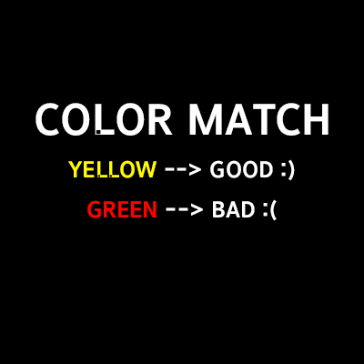
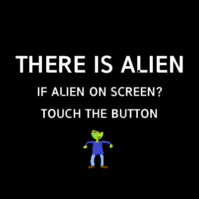
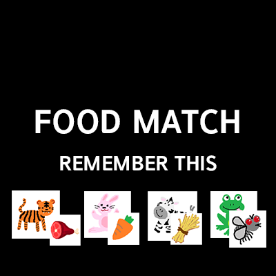
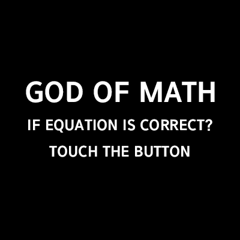
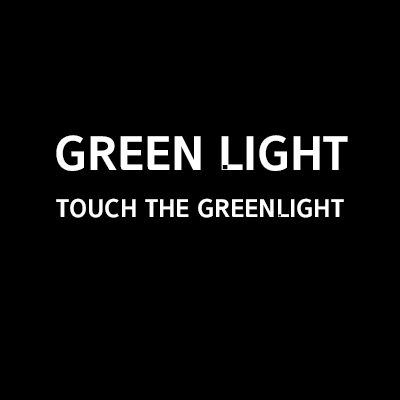
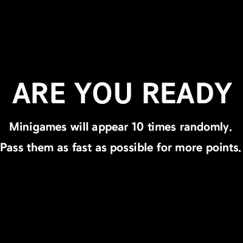
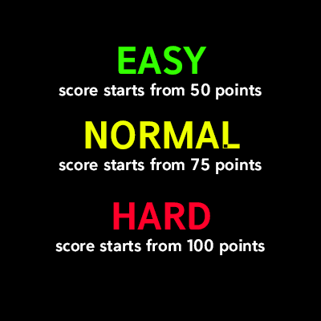

# FAST REACTOR GAME (오픈소스)

## 프로젝트 명

FAST REACTOR GAME

## 기획 및 개발

문진혁

## 제작 기간

2022.05.31 ~ 2022.06.09 

## 사용 기술

- **Front-End**: Html , Css , Bootstrap, JavaScript

## 배포

서버가 없는 프로젝트이다. html을 실행시키면 된다

[FastReactor](https://fastreactor.netlify.app/)

플레이스토어 배포

[](https://play.google.com/store/apps/details?id=com.jinhyuk.fastreactorgame)

## 프로젝트 기획 배경

 최근 steam에 출시되었던 “VamFire Survivors”라는 JS기반의 게임을 보고, Javascript 기반의 게임을 한번 제작해보고 싶어서 어떤 주제로 할지 생각중에, 기존에 Reactor game이라는 반응속도 게임을 한번 구현을 해보고 싶어서 이 프로젝트를 기획함.

## 추후 예정

- 순위 만들기
- achivement 기능 제작

## 구현

- **이미지 요청**
    
    게임의 특성 상 이미지를 계속 요청해야 하는데, 게임의 리듬이 매우 빠르기 때문에 이미지를 불러오고 화면에 부착하는 시간이 게임 속도보다 느렸음
    
    - 해결방안
        
         처음 html을 불러올때 이미지를 모두 불러오는 과정을 통하여 이미지를 계속 요청하지 않음.

         ```html
         <div>
            
            
            
            
            
            
            
            
            
            
            
            
            
            
            
            
            
            
            
            
            
            
            
            
            
            
            
            
            
            
            
            
            
            
            
            
            
            
          </div>
          ```
        
    - 추후 개선방안
        
        실제로 네이버나, 다음 등 대형 포탈에서 사용하는 SpriteImage를 사용하여 보다 코드를 간결하게 제작해야 할 것같다. 
        
- **기본적인 게임 기능**
    ```jsx
    function PMPD(){
        $(".score").text(String(soloscore))
        let text_box = '<div class="pmpd">{}</div>'
        let ranNum = Math.floor(Math.random()*10)
        let ranNum2 = Math.floor(Math.random()*10)
        let ranNum3 =Math.floor(Math.random()*4)+1
        let ranNum4 = Math.floor(Math.random()*3)+1
        if(ranNum3 == 4) {
            if(soloscore>=110){
                if(ranNum4 == 2){
                    let rst =ranNum-ranNum2
                    text_box = text_box.replace('{}',ranNum + ' - '+ranNum2 +' = '+rst)
                }
                else{
                    let rst =ranNum+ranNum2
                    text_box = text_box.replace('{}',ranNum + ' + '+ranNum2 +' = '+rst)
                }
            }
            else{
                let rst =ranNum+ranNum2
                text_box = text_box.replace('{}',ranNum + ' + '+ranNum2 +' = '+rst)
            }
        }
        else{
            if(soloscore>=110){
                if(ranNum4 == 2){
                    let rst =ranNum-ranNum2+ranNum3
                    text_box = text_box.replace('{}',ranNum + ' - '+ranNum2 +' = '+rst)
                }
                else{
                    let rst =ranNum+ranNum2+ranNum3
                    text_box = text_box.replace('{}',ranNum + ' + '+ranNum2 +' = '+rst)
                }
            }
            else{
                let rst =ranNum+ranNum2+ranNum3
                text_box = text_box.replace('{}',ranNum + ' + '+ranNum2 +' = '+rst)
            }
            
        }
           
        $(".game_text").html(text_box)
        $(document).on("click","#ansbtn",function(){
            if(ranNum3 == 4){
                
                
                $(document).off("click")
                clearInterval(ongame)
                Success(count)
                
            }
            else{
                $(document).off("click")
                clearInterval(ongame)
                Fail(count)
            }
        })
        if(ranNum3 == 4){
            if(rlcount==2){
                soloscore-=1
                rlcount=0
            }
            rlcount++
        }
    }
    ```
    게임은 일회성 함수호출로 이어지기 때문에 게임 중앙 버튼을 눌렀 을 경우 clearInterval()을 통하여 잠시 중단 후 Success() 또는 Fail()함수를 호출 시킨다.

    ```jsx
    function Success(){
        $(".game_text").css("background-color","transparent")
        let text_box = '<div>{}</div>'
        if(lang==1){
            text_box = text_box.replace('{}',"GOOD :)")
        }
        else{
            text_box = text_box.replace('{}',"성공!")
        }

        $(".game_text").html(text_box).css("background-color","transparent")
        $(".touch-view").css("display","none")
        settime =setTimeout(function(){
            clearTimeout(settime)
            SoloPlay(soloscore+10, solostage+1,faster+10)
        },2000)

    }
    function Fail(){
        let text_box = '<div>{}</div>'
        if(lang==1){
            text_box = text_box.replace('{}',"BAD :(")
        }
        else{
            text_box = text_box.replace('{}',"땡!")
        }

        $(".touch-view").css("display","none")
        $(".game_text").html(text_box).css("background-color","transparent")
        settime =setTimeout(function(){
            clearTimeout(settime)
            SoloPlay(soloscore-5, solostage+1,faster+10)
        },2000)
    }
    ```
    
    다음과 같은 템플릿의 여러가지 게임을 만들어 랜덤으로 진행시켰다.

- **게임 점수 저장 구현**
    
    게임 플레이를 하게 되면 점수를 저장하는 것은 게임의 중요한 요소가 될 수 있다. 이를 저장하기 위해 Cookie , session Storage , Local Storage 중 무엇을 사용할까 고민 하다가 브라우저 또는 앱을 꺼도, 점수가 저장되게 하기 위해 LocalStorage를 사용하기로 하였다.

    ```jsx
    if(score >= localStorage.getItem("score")){
        localStorage.setItem("score",score)
        $(".inso").css("color","yellow").text("!NEW SCORE!")
        
    }
    ```
    기본으로 localStorage에 점수가 없다면 0으로 세팅하고, 만약 localStorage의 점수보다 큰 점수를 얻을 경우에만 업데이트를 해주는 형식으로 제작하였다.
    
- **하나의 Html에서 구현, JavaScript로 동작**
    
    하나의 Html에서 구현되는 시스템이기 때문에, 각 div태그들이 어디에 위치해있는지, visible,여부들을 모두 확인하면서 제작해야 했다.
